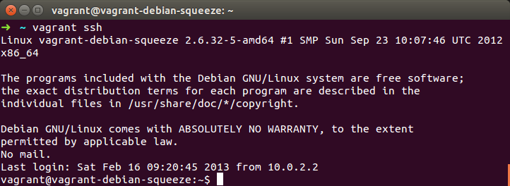

## Ejercicios Tema 4 - Antonio David López Machado

#### 1- Instalar una máquina virtual Debian usando Vagrant y conectar con ella.
```
vagrant box add debian http://www.emken.biz/vagrant-boxes/debsqueeze64.box
```


Una vez creada debemos initializarla para ello:
```
vagrant init debian
```


Despues levantamos la maquina virtual:
```
vagrant up
```


Y por último conectamos con ella:
```
vagrant ssh
```


#### 3- Crear un script para provisionar de forma básica una máquina virtual para el proyecto que se esté llevando a cabo en la asignatura.

```
Vagrant.configure("2") do |config|

	config.vm.box = "debian8"

	config.ssh.insert_key = false

	config.vm.provision "shell",
		inline: "sudo apt-get install -y python3-dev python3-pip git"
  end

end
```

#### 4- Configurar tu máquina virtual usando `vagrant` con el provisionador ansible
Primero tenemos que crear descargar la imagen a provisionar. Para ello:
```
vagrant box add debian8 https://github.com/holms/vagrant-jessie-box/releases/download/Jessie-v0.1/Debian-jessie-amd64-netboot.box
```

Una vez realido esto debemos initializarla:
```
vagrant init debian8
```

Tras tener creado el fichero VagrantFile podemos proceder a su modificación para incluir el provisionamiento con ansible. El contenido del fichero tras modificarlo es:

```
Vagrant.configure("2") do |config|

	config.vm.box = "debian8"

	config.ssh.insert_key = false

	config.vm.provision "ansible" do |ansible|
		ansible.playbook = "provision.yml"
  end

end
```


Tras levantar la máquina virtual (vagrant up) nos realizara el provisionamiento de la máquina como podemos ver en la imagen.


