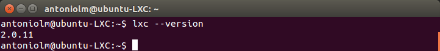
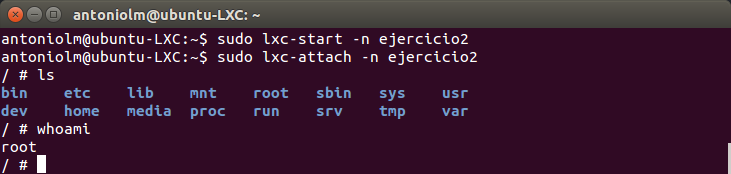
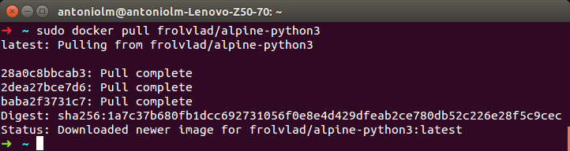
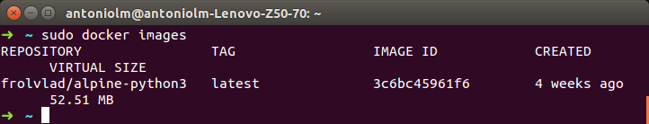
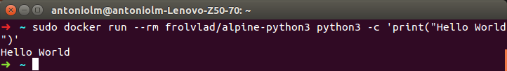
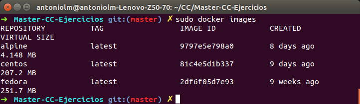
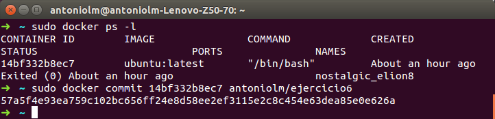
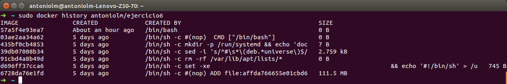

## Ejercicios Tema 4 - Antonio David López Machado

#### 1- Instala LXC en tu versión de Linux favorita. Normalmente la versión en desarrollo, disponible tanto en GitHub como en el sitio web está bastante más avanzada; para evitar problemas sobre todo con las herramientas que vamos a ver más adelante, conviene que te instales la última versión y si es posible una igual o mayor a la 2.0.

Para la instalación se ha utilizado una máquina virtual en azure con una imagen de Ubuntu 16.04LTS.

La instalación de lxc se ha realizado con la siguiente instrucción:
```
sudo apt-get install lxc
```

Y como podemos observar podemos obtener la versión de lxc en nuestra máquina virtual.



#### 2- Instalar una distro tal como Alpine y conectarse a ella usando el nombre de usuario y clave que indicará en su creación

El primer paso sera descargar la imagen. Para ello:
```
sudo lxc-create -t alpine -n ejercicio2
```

Tras esto ya podriamos conectar a Alpine con las siguientes instrucciones:
```
sudo lxc-start -n ejercicio2
sudo lxc-attach -n ejercicio2
```
Y como podemos observa en la imagen la conexión se ha establecido con exito.



#### 4- Buscar alguna demo interesante de Docker y ejecutarla localmente, o en su defecto, ejecutar la imagen anterior y ver cómo funciona y los procesos que se llevan a cabo la primera vez que se ejecuta y las siguientes ocasiones.

La imagen seleccionada ha sido : https://hub.docker.com/r/frolvlad/alpine-python3/ la cual es una imagen interesante ya que
su tamaño es muy reducido (~61mb) y tiene instalado tanto python3 como su gestor de paquetes pip3.

Para ejecutarlo primero debemos descargarla para ello:

```
sudo docker pull frolvlad/alpine-python3
```


Tras esto podemos ver la imagen descargada con el comando:

```
sudo docker images
```


Tras esto, podemos trabajar con python3 a traves del contenedor de una forma sencilla como podemos ver a continuación:
```
sudo docker run --rm frolvlad/alpine-python3 python3 -c 'print("Hello World")'
```


#### 5- Comparar el tamaño de las imágenes de diferentes sistemas operativos base, Fedora, CentOS y Alpine, por ejemplo.

Para la comparación, he realizado la instalación de cada una de ellas y como podemos apreciar con el comando (docker images) podemos apreciar como tanto centos y fedora tienen un tamaño considerable (~200mb) mientras que alpine solo ocupa ~4mb.



Esto nos permite ver como alpine puede ser una buena opción cuando necesitas velocidad de creación de contenedores.

#### 6- Crear a partir del contenedor anterior una imagen persistente con commit.

Para esto debemos realizar la siguiente instrucción con el contenedor del que queramos obtener una imagen persistente.

```
sudo docker commit <id container> antoniolm/ejercicio6
```



#### 7- Examinar la estructura de capas que se forma al crear imágenes nuevas a partir de contenedores que se hayan estado ejecutando.

Para ver la estructura de capas de nuestra imagen deben ejecutar la siguiente instrucción:
```
sudo docker history antoniolm/ejercicio6
```

Y como podemo ver en la imagen, la última capa es la que nosotros creamos y la penúltima es la de la imagen utilizada para crear nuestra imagen persistente.



#### 9- Usar un miniframework REST para crear un servicio web y introducirlo en un contenedor, y componerlo con un cliente REST que sea el que finalmente se ejecuta y sirve como “frontend”.

Para ello he realizado la siguiente composición:
* Web realizada en flask
* Mongo db como contenedor de datos del sitio web

El docker-compose.yml utilizado ha sido :
```

version: '2'

services:
  mongo:
    image: 'mongo:latest'
    container_name: mongo
    volumes:
      - 'mongo:/data/db'

  service:
    build: compose/service
    container_name: service
    ports:
      - "80:5000"
    depends_on:
      - 'mongo'

volumes:
mongo:
```
y el dockerfile de nuestro servicio en flask es:
```
FROM frolvlad/alpine-python3

MAINTAINER Antonio David López Machado <antdlopma@gmail.com>
WORKDIR /app

ADD static/style.css /app/static/style.css
ADD templates/index.html /app/templates/index.html

RUN apk update && apk upgrade
RUN apk add git

RUN pip3 install flask pymongo
COPY ./service.py /app

ENTRYPOINT ["python"]
CMD ["service.py"]
```
